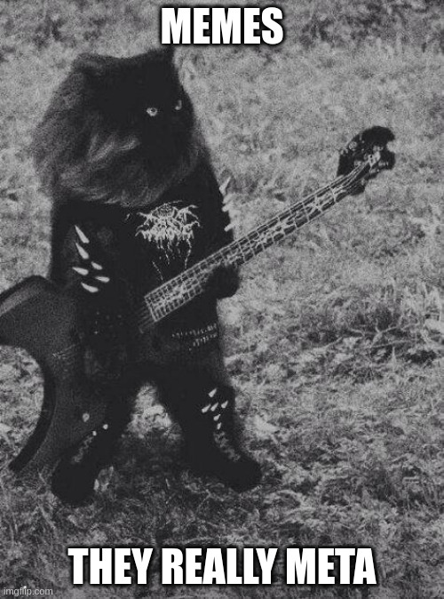

# The Dream Meme Team


MemeFrames are permaweb pages with a DAO _inside_. It's kinda like Intel, except much cooler.

## Meme-ception

It's all a meme-within-a-meme. A meta-meme. 



## How to use this

1. Get `aos` with 
2. Run `aos` by simply typing `aos` in your terminal.
3. Store our community MemeFrame in your process' memory:

```lua
MEMEFRAME = "rKKhazli2Av4BcIzH95fSKSO2faM6_mzJhkPD4FJHUQ"
```

4. Get some CRED by completing [Quests on `ao`](https://cookbook_ao.g8way.io/tutorials/begin/index.html).
5. Send your CRED to us :)

```lua
Send({Target = CRED, Action = "Transfer", Quantity = "1000", Recipient = MEMEFRAME})
```

6. Stake the MEME tokens you receive when you send us CRED.

```lua
Send({Target = MEMEFRAME, Action = "Stake", Quantity = "1000", UnstakeDelay = "1000" })
```

7. Vote to change the frame

```lua
Send({ Target = MEMEFRAME, Action = "Vote", Side = "yay", TXID="..." })
```

## Join the community

You can find us chatting in super-shadowy, meme-lords only chats somewhere in `ao`. In order to do so:

1. Copy the [chat.lua file](/process/chat.lua) into the same directory you're running `aos` from.
2. Launch `aos`.
3. Run `.load chat.lua` in your interactive console and follow the instructions to find us.